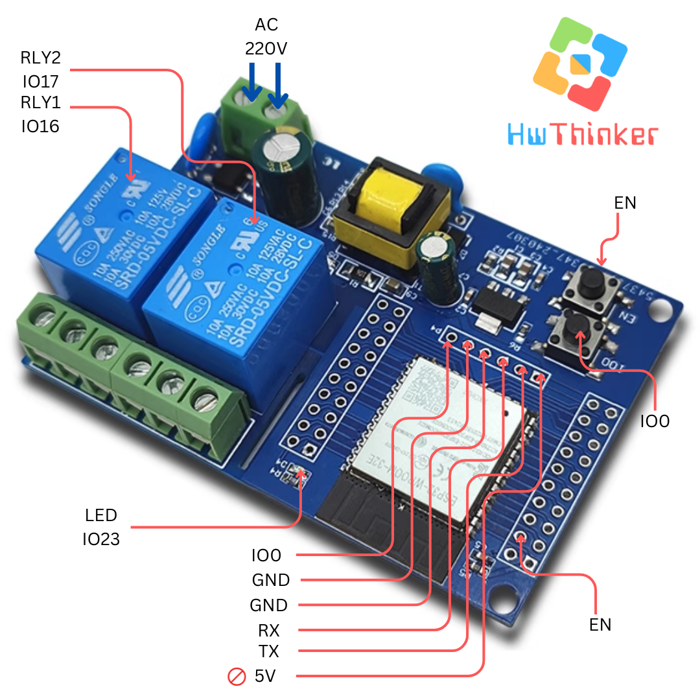
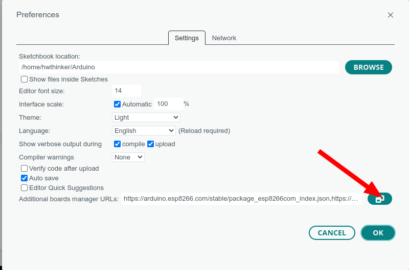
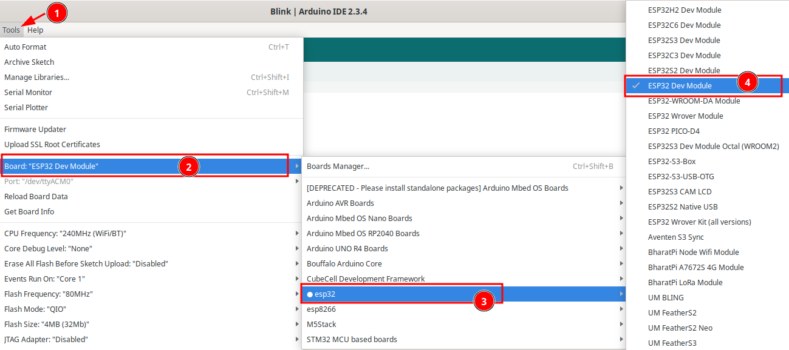
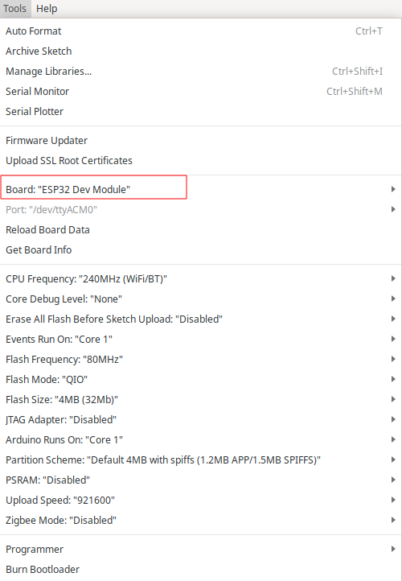
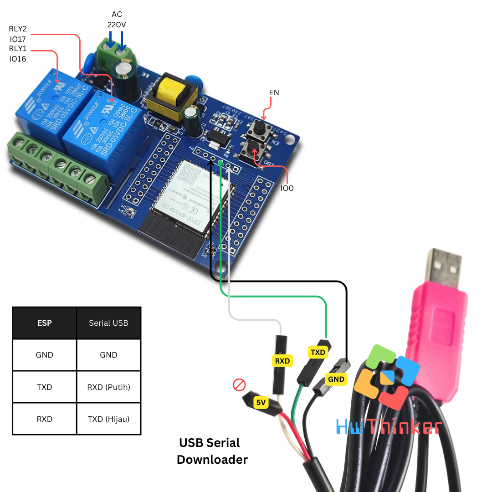
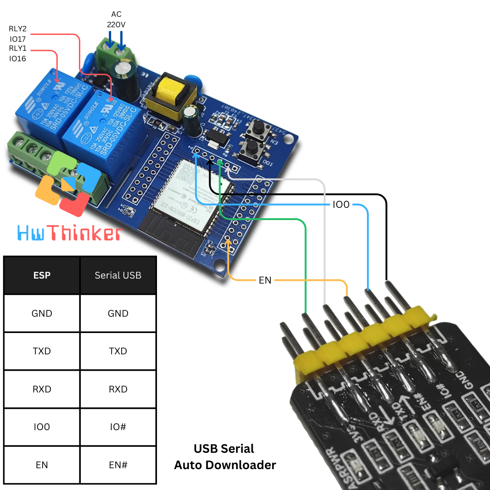

# Modul ESP32 Relay 2 Channel -AC 


## Cara install plugin Arduino IDE

### Langkah 1: Buka Arduino IDE

1. Buka aplikasi Arduino IDE di komputer Anda. Jika belum ada, unduh dan instal Arduino IDE dari situs resmi Arduino di https://www.arduino.cc/en/software. disarankan menggunakan arduino ide versi 2

### Langkah 2: Tambahkan URL Board Manager untuk ESP32

2. Di Arduino IDE, buka **File** > **Preferences**.

   

3. Pada bagian  Additional Boards Manager URLs, tambahkan URL berikut:

```
https://espressif.github.io/arduino-esp32/package_esp32_index.json
```

4. Jika sebelumnya Anda sudah memiliki URL lain di sana, pisahkan URL ini dengan tanda koma atau baris baru.


### Langkah 3: Buka Boards Manager

1. Buka **Tools** > **Board** > **Boards Manager**.


2. Di kotak pencarian, ketik **ESP32**.

### Langkah 4: Instal Board ESP32

1. Temukan **ESP32 by Espressif Systems** di daftar, kemudian klik **Install**.


2. Tunggu hingga proses instalasi selesai.

### Langkah 5: Pilih Board ESP32

1. Setelah instalasi selesai, Anda dapat memilih board ESP32.
2. Buka **Tools** > **Board**, dan gulir ke bawah untuk menemukan berbagai jenis board ESP32 yang telah diinstal. Pilih board yang sesuai, misalnya **ESP32 Dev Module** 



3. hasilnya kurang lebih seperti ini



### Langkah 6: Pilih Port

1. Sambungkan board ESP32 ke komputer Anda menggunakan kabel USB.
2. Di **Tools** > **Port**, pilih port yang sesuai dengan ESP32 Anda.

## Contoh Program

```c++
#include <Arduino.h>

#define RLY1 16
#define RLY2 17
#define LED 23
// the setup function runs once when you press reset or power the board
void setup() {
  // initialize digital pin LED_BUILTIN as an output.
  pinMode(RLY1, OUTPUT);
   pinMode(RLY2, OUTPUT);
  pinMode(LED, OUTPUT);
}

// the loop function runs over and over again forever
void loop() {
  digitalWrite(RLY1, HIGH);  // turn the LED on (HIGH is the voltage level)
  delay(1000);                      // wait for a second
  digitalWrite(RLY1, LOW);   // turn the LED off by making the voltage LOW
  delay(1000);    

  digitalWrite(RLY2, HIGH);  // turn the LED on (HIGH is the voltage level)
  delay(1000);                      // wait for a second
  digitalWrite(RLY2, LOW);   // turn the LED off by making the voltage LOW
  delay(1000);   
  
  digitalWrite(LED, HIGH);  // turn the LED on (HIGH is the voltage level)
  delay(1000);                      // wait for a second
  digitalWrite(LED, LOW);   // turn the LED off by making the voltage LOW
  delay(1000);                   // wait for a second
}
```


## Cara Upload Program dengan Serial USB biasa


- Pasang serial USB TTL dengan ketentuan: 
   - TX -> RX USB Serial (Kabel Putih)
   - RX -> TX USB Serial (Kabel Hijau)
   - GND -> GND USB Serial (Kabel Hitam)
- Pastikan supply DC 9-12V  dihubungkan 2 pin Terminal block(terdapat label VCC)
- Pastikan GND supply dihubungkan dengan GND 
- Tekan dan tahan tombol IO0 
- klik (tekan dan lepas) tombol EN dan pastikan  tombol IO0 masih di tekan
- Lepas tombol IO0
- upload program dan tunggu sampai selesai
- klik tombol EN untuk run-program (langkah ini penting agar firmware baru dijalankan)
- ulang langkah awal bila melakukan download ulang lagi


## Cara upload dengan Serial USB auto Download

- Pasang serial USB TTL dengan ketentuan:
    - RX -> RX USB Serial  
    - TX -> TX USB Serial 
    - GND -> GND USB Serial  
    - IO0 -> IO# USB Serial 
    - EN -> EN# USB Serial
- Pastikan supply DC 9-12V  dihubungkan 2 pin Terminal block(terdapat label VCC)
- Pastikan GND supply dihubungkan dengan GND 
- upload program dan tunggu sampai selesai


>[!NOTE]
> Untuk serial disarankan menggunakan serial auto download
>
> - https://tokopedia.link/KbEeomXRMPb atau
> - https://shopee.co.id/product/21375728/27056587756/ 


## Pemecahan Masalah

### A. Port Com tidak dapat dikenali di Arduino

Masuk ke mode unduh:

- Tekan dan tahan tombol Boot/0
- Klik(tekan dan lepas) tombol reset/EN sambil tetap tekan tombol Boot .
- Lepas tombol boot
- Setelah selesai Wajib klik tombol **reset** sekali lagi untuk berpindah dari mode download menjadi mode run

### B. Program tidak dapat berjalan setelah diunggah

Setelah upload berhasil, Anda perlu menekan tombol Reset sebelum dapat dijalankan.

